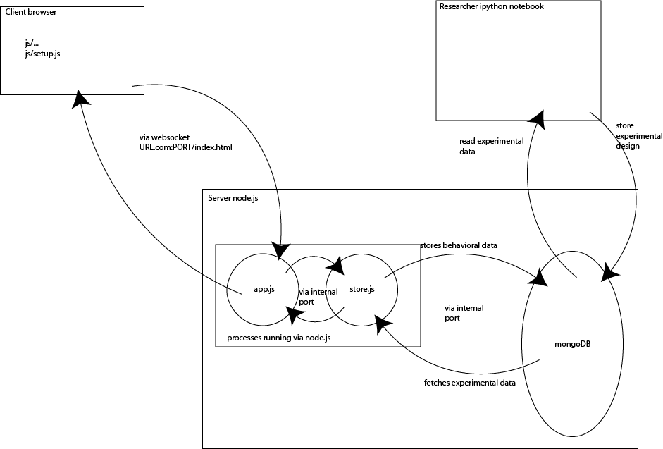

# Experiments

## Experimental design
  

See [pregistration_neurips2021.md](prereg/preregistration_neurips2021.md) for details.

## Schema of the experiment

The general structure of the experiments is as follows:

  

Each experiment is stored in a separate folder. Each experiment follows the same structure:
* `js/` contains the javascript code running in the client browser
* `app.js` and `store.js` are run on the server using `node.js`
* the stimuli and experimental design are read from a mongoDB
* the results are stored in a mongoDB

## Setting up the server

First, copy the experiment folder to the server (eg. by using `git clone`). Make sure that `node.js` and `npm` are installed.

### Install node.js packages
Navigate to the experiment folder and run `npm install .` to install all node.js packages.

### mongoDB
Make sure that you have read and write access to a mongoDB (on the same or a different server). `store.js` communicates with the mongoDB instance. 
The experiments use the following collections:
* `Stimuli/EXPERIMENT_NAME` for the stimuli and experiment design
* `EXPERIMENT_NAME` to record the results

## Running the experiment

Make sure that the processes that you start are persistent. If you use ssh, use `tmux` or `screen` to keep the processes running.

Then, run `node app.js` and `node store.js`.
To change the public-facing port, run `node app.js --gameport XXXX`.
Make sure that the port is publicly accessible.

The experiment should now be available at `https://SERVER.COM:XXXX/index.html`, with XXXX being the chosen port number.
Note that https (rather than http) is required for the experiment to work.

If you get errors relating to the gameport, try changing the `--gameport` argument to a different port. 
If you get errors regarding the port `app.js` and `store.js` use to communicate, you need to change this port for internal communication. This port is specified in `app.js:118` and `store.js:15`. Only one pair of processes can use the same internal port to communicate at a time. This port does not need to be publicly accessible.

### Prolific integration

The experiments are set up to work with [prolific](https://prolific.co), an online platform for recruiting participants. 
When using prolific, the experiment is called using additional information in the URL:
`https://SERVER.COM:XXXX/index.html?PROLIFIC_PID=XXX&SESSION_ID=XXX&STUDY_ID=XXX`

The prolific ID will automatically be saved along with the other data.

In `js/setup.js:402`, the prolific completion URL is specified that participants will be redirected to complete the hit. You'll need to change this URL to the one provided by prolific when you set up the experiment.

## Adapting the experiment

Changing the stimuli means replacing the list of stimuli to be presented in the stimuli database on mongoDB. 
To do this, use the `stimuli/generate_metadata.ipynb` notebook to generate lists of stimuli and place them on the server. Make sure to specify the correct experiment name.

The stimuli themselves are hosted on S3 (but they might as well be hosted in some other place). To upload stimuli to S3 with the correct URLs, use `stimuli/upload_stimuli_to_S3.ipynb`.

### Important fields

There are multiple places throughout the name of the experiment and the databases it draws from are specified. 

**Stimuli collection name** is specified in `app.js:79`. This is the name of the collection in the stimuli database in mongoDB and determines the stimuli and experimental design that the experiment uses.

**Experiment kind** is specified in `store.js:161`. This tells `store.js` which collection in the `Stimuli` database in mongoDB to use. You likely won't need to change this.

**Database name** to record the human behavioral data is specified in `js/setup.js:15`. This specifies the database the human behavioral data is inserted into.

**Collection name** is specified in `store.js:16`. This specifies the collection in the database to use that the behavioral data is inserted into.

**Iteration name** is stored in `js/setup.js:17`. This specifies the iteration of the experiments, which marks the saved data, but does not determine which data gets pulled. This is useful when making changes to the experiment.

### Making changes to the experiment itself

The experiment uses jspych. 
`setup.js` contains the code that sets up various jspsych pages. 
Many common actions (such as changing the possible responses) are possible here. 
However, if you want to go more into depth, you can also make changes to the jspsych files (eg. `jspsych-video-overlay-button-response.js`) directly.

## Retrieving the results

The behavioral data will be recorded into a mongoDB database according the database name specified in `app.js:79`.

Every interaction will be saved as its own entry in the database. Each entry will have a prolific ID (treat this as potentially personally identifiable information) and a session ID. 
Different types of entries are recorded (ie: ratings, demographics, etc.).

To get the data, pull the data from the collection in the database. 