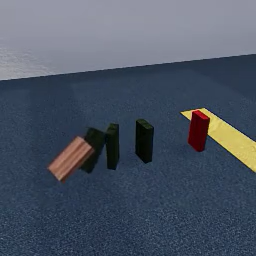

# Pregistration

**Researchers**: 
<!-- Not actually sure who everyone on the project actually is -->

## Study information
<!-- give your study a brief and informative title -->
**Title**: Human physics benchmarking

### Research questions
<!-- specify the broad and specific questions guiding your study -->
Predicting the future outcome of physical scenarios is a paradigm case of using models to represent and reason about the world. Intuitive physics is central to intelligent behavior in physical environments. 
In this study, we aim to identify features of physical scenes that make correct human physical prediction difficult. 
Additionally, we aim to collect data on which scenes are difficult for human subjects to predict correctly in order to compare human subjects against a range of computational models of physical scene prediction. 

### Hypotheses
<!-- list 2 specific, concise, and testable hypotheses, including the if-then logic statements for your predictions. -->
We predict that scenes which (1) contain more elements, (2) contain distractor elements and (3) contains occluder elements are harder to correctly predict for human subjects. 
Additionally (4), we predict that scenes that lead to more incorrect predictions also tend to have a longer reaction time (ie. people take longer to come up with an answer to difficult scenes).

<!-- Also: camera angle, jitter, percent of target visible (_id map) -->
 
## Design Plan
###   Study type
 <!-- indicate whether your study will be experimental or correlational -->
 Experimental
###   Study design: stimulus generation 
 <!-- describe the overall design of the study (what will be manipulated and/or measured, specify whether manipulations will be between- or within-subjects, etc.) -->
 Within-subjects design. All subjects will be shown XXX scenes drawn from a set in random order.

**Stimulus dimensions**\
 The scenes in the set vary along the following dimensions:
 | Dimension | Levels |
 | --- | --- |
 | Background type | 3 types of rooms |
 | Number of physical elements ("dominoes") | 2-4 |
 | Number of distractor objects (which are shown behind the physical elements) | 0-2 |
 | Kind of distractor objects (which are shown behind the physical elements) | tdw 3d object library |
 | Number of occluder objects (shown in front of and partially covering the physical objects) | 0-2 |
 | Kind of occluder objects (shown in front of and partially covering the physical objects) |tdw 3d object library |
 | Color of the (non-target) physical objects | dark brown, dark green, dark blue |
 | Positional jitter of the physical objects |`TODO: specify levels` |
 | Rotational jitter of the physical objects |`TODO: specify levels`|
 | Camera positions | chosen such that all objects are visible |

 Scenes are generated by randomly selecting a value of the preceding dimensions and generating XXX scenes. From this set, XXX will be randomly sampled such that 50% of the chosen scenes are positive trials (ie. the red target object touches the yellow target zone) and 50% are negative trials. Additionally, we attempt to sample scenes such that the distribution of the other dimensions is roughly equal if possible. 
 Stimuli will be manually checked to ensure that all scenes are usable, do not contain off screen elements, exhibits bugs in the physics engine, contain clipping objects, ...

Example stimulus:\
  

####   Manipulated variables
 <!-- If applicable, precisely define any variables you plan to manipulate, including the levels and whether the manipulation will be between or within subjects. -->
As outlined above, subjects are not assigned to any conditions. The manipulations consist of the stimuli with underlying parameters as well as the sampling of stimuli.

###   Study design: evaluation protocol 

**Sequence of events in a session**
1. Consent form and study information
2. Task explanation
3. Familiarization trials – 5 initially shown, with up to 10
    1. Video is played for 1500ms, then hidden
    2. Prediction is queried from subject (yes/no)
    3. Full video is shown and feedback is given (correct/incorrect)
4. If sufficient number of familiarization trials guessed correctly (4 out first 5 OR three correct in a row) proceed to (5.) otherwise end of study
5. Not informing subjects that the main part of the trial starts
6. 100 trials
    1. Fixation cross is shown for random interval between 500ms and 1000ms
    2. Video is played for 1500ms, then hidden
    3. Prediction is queried from subject (yes/no)
7. Demographics & Feedback
    * age
    * gender
    * education level
    * difficulty rating ("How difficult did you find this task?", 5 point Likert scale)
8. Subjects are shown their rate of correct guesses and percentile
9. End of study

 Before trials begin, subjects are shown 5 familiarization trials. After making a prediction, they are informed whether the prediction was correct and is shown the unabridged stimulus including the result of the trial. 
 Participants will only be allowed to proceed to the main section if they have gotten 4 out of 5 correctly. If not, subjects will be shown additional familiarization trials until they have gotten 3 correct trials in a row. If subjects have not advanced after being shown 10 familiarization trials, they are still allowed to participate in the experiment, but the session will be flagged. 

 Each stimulus consists of a short video of a row of "dominoes" (physical objects), where the first domino is toppled by applying a force and the last one ("target object", colored red) is placed in front of a yellow target area. The video end after 1500ms, so whether or not the target object falls on the target area is not shown. 
 Subjects are tasked with responding "yes" or "no" depending on whether they'll be predict that the target object will hit the target area in the remainder of the video (not shown). No feedback during trials is given.

 Each trial is preceded by a fixation cross shown for a time randomly sampled from the interval $[500,1500]$ ms. After $1500$ms, the video is removed and the white background is shown in its place (so subjects need to rely on the information they were able to gather in the $1500$ms to make their prediction). The next trial is started immediately after giving a response. 
 To account for side biases, the order of response button is randomized between subjects

Each subject is shown 100 scenes in random order sampled from the set of scenes generated as described above. Scenes are sampled such that 50 of the scenes shown to the participant are positive (ie. the red target objects touches the yellow zone) and 50 are negative.

###   Measured variables
 <!-- Precisely define each variable that you will measure. This includes outcome measures, as well as other measured predictor variables. -->
We measure:
* `response`: prediction (either yes/no)
* `rt`: time taken to make prediction

 After the trials, subjects will be asked to provide:
 * age
 * gender
 * education level
 * difficulty rating ("How difficult did you find this task?", 5 point Likert scale)
 <!-- * one trial Shephard Metzler mental rotation task (`TODO: keep in the experiment? either investigate how many of these items would we need to ensure measurement reliability or defer to think about how to incorporate other classic spatial-cognition tests in the future to estimate within-subject between-task covariation.`) -->
 * free form feedback on the task

 After the end of the study, subjects will be told their overall accuracy and the corresponding percentile compared to other subjects on the study. 

## Sampling Plan
###   Data collection procedure
 <!-- describe the method you will use to collect your data, and your inclusion/exclusion criteria. This should include your sampling frame, how participants will be recruited, and whether/how they will be compensated. -->
Participants will be recruited from {Prolific/Amazon Mechnical Turk/SONA/XXX} and compensated $XXX, which roughly corresponds to $12/hr. Subjects will not be rewarded for correct responses.

Subjects are only allowed to take the task once.

###   Sampling procedure
 <!-- indicate your target sample size and why that is your target (might be based in past research, for example) -->
The study will be run in two phases: a first phase iterating generating stimuli and evaluating them and a second phase collecting fine grained data on a chosen set of stimuli.

#### Phase 1: Stimulus Optimization
This phase aims to evaluate stimuli to ensure that they are of commensurate difficulty. 
In order to investigate how well people can predict physics, the stimuli should neither be too simple nor too difficult. Thus, we are aiming at about 75% correct predictions (50% is chance). 

In phase 1, we iterate between generating a set of stimuli as described above and collecting data using that set of stimuli. Based on the average rate of correct predictions as well as the relation between single dimensions and rate of correct predictions the parameters underlying the stimulus generation are updated to achieve a stimulus set of about 75% rate of correct predictions and a varying difficulty between individual stimuli. 
Specifically, exploratory analysis showing the relation of different dimensions to difficulty (see below) allow for tweaking of the stimuli to reach the desiderata.

For each iteration of the stimulus set, we aim to run 10 participants. However, the aforementioned measure will be continuously evaluated and the stimulus set might be exchanged earlier. 

#### Phase 2: Deployment at scale
After a particular set of stimuli has been chosen, we aim to collect fine grained data. After a particular set of stimuli satisfying our desiderate has been chosen ((1) about 75% total accuracy, (2) spread of difficulty between stimuli), we collect subjects up to a total of XXX subjects. 

 <!-- ###   Stopping rule -->
 <!-- specify how you will determine when to stop data collection -->
 <!-- Data collection will be stopped after the planned number of subjects has been recorded. -->

## Analysis Plan
###   Data exclusion
 <!-- How will you determine which data points or samples (if any) to exclude from your analyses? How will outliers be handled? Will you use any awareness or attention check? -->
 No explicit awareness check will be performed. 
 Subjects will be excluded if they display a sequence of responses clearly not related to the actual stimuli shown, precisely a sequence that either:
 * contains XXX consecutive "yes" or "no" answers (`TODO: quickie simulation to figure out the streak length that occurs <0.001 of the time`)
 * contains a sequence of at least XXX iterating "yes" or "no"
 * were shown 10 familiarization trials (subjects guessed fewer than 4 out of the first 5 correctly and never got 3 correct guesses in a row in the subsequent 5) 
 
 Excluded sessions will be flagged.
 Flagged sessions will not be included in the analyses. The analyses will be run again with the flagged sessions included to investigate whether the outcome of analyses changes with the flagged sessions included.
 
###   Missing data
In phase 1, participants data will be included if they have completed at least 30% of experimental trials (excluding familiarization). In phase 2, trials with missing data (ie. if a subjects stop mid-way through) will be discarded.

###   Planned visualization
 <!-- Describe what kind of visualization you would use (e.g. boxplot, faceted histogram, scatterplot, etc.) to evaluate your data and determine what it can tell you about your research question -->

For each stimulus dimension, the following is produced:
* A scatter plot, in which the points correspond to individual stimuli. The x-axis represents the stimulus dimension (with jitter applied if the measure is ordinal), the y-axis represents the percentage of correct predictions out of all predictions for that stimulus. 
<!-- Points are colorized according to the presence of distractor objects and the symbol representing the point denotes the presence or absence of occluder objects. -->

* Additionally, marginal bar plots showing rate of correct prediction for stimuli according to the values of the stimulus dimension (grouped if necessary).

* To investigate reaction time as a function of rate of correct predictions, we show a scatter plot in which the x-axis represents the rate of correct predictions and the y-axis the mean reaction time (with confidence intervals shown). The points correspond to individual stimuli. A fit line is shown.

###   Predicted results
 <!-- What pattern do you expect to see in your planned visualization, based on the hypotheses you described earlier? -->
 We expect to see a monotonic decrease in perfect predictions with increased number of objects. Likewise, we expect the presence of distractor and occluder objects to lead to a lower rate of perfect reconstructions. 

 We also expect that the harder a stimulus is to predict correctly, the longer subjects take to make a response.

###   Exploratory analysis
 <!-- If you plan to explore your data to look for unspecified differences or relationships, you may include those plans here. If you list an exploratory test here, you are not obligated to report its results, but you are obligated to describe it as an exploratory result. -->
We aim to explore the relation of demographic variables as well as the result of a one-trial spatial reasoning task on the performance of subjects: how does age, gender, educational status and the the result of a one-trial spatial reasoning task relate to the overall accuracy of a subject?

Additionally, we aim to explore whether subjects show a consistent bias towards towards positive/negative predictions. left/right biases. 

<!-- We might also explore whether the speed of response predicts its correctness. Curve might be inverted U-shape: too fast or too slow leads to bad predictions. Perhaps too fast not, since the subjects always get 1500ms -->
