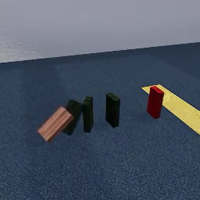

# Pregistration for NeurIPS 2021 submission

**Researchers**: Felix Binder, Cameron Holdaway, Sirui Tao, Daniel Bear, Judy Fan ... and then some
<!-- Not actually sure who everyone on the project actually is -->

## Study information
<!-- give your study a brief and informative title -->
**Title**: Human physics benchmarking

### Research questions
<!-- specify the broad and specific questions guiding your study -->
Predicting the future outcome of physical scenarios is a paradigm case of using models to represent and reason about the world. Intuitive physics is central to intelligent behavior in physical environments. 
In this study, we aim to identify features of physical scenes that make correct human physical prediction difficult. 
Additionally, we aim to collect data on which scenes are difficult for human participants to predict correctly in order to compare human participants against a range of computational models of physical scene prediction. 

### Hypotheses
<!-- list 2 specific, concise, and testable hypotheses, including the if-then logic statements for your predictions. -->
We predict that scenes which (1) contain more elements, (2) contain distractor elements and (3) contains occluder elements are harder to correctly predict for human participants. 
Additionally (4), we predict that scenes that lead to more incorrect predictions also tend to have a longer reaction time (ie. people take longer to come up with an answer to difficult scenes).

<!-- Also: camera angle, jitter, percent of target visible (_id map) -->
 
## Design Plan
###   Study type
 <!-- indicate whether your study will be experimental or correlational -->
 Experimental
###   Study design
 <!-- describe the overall design of the study (what will be manipulated and/or measured, specify whether manipulations will be between- or within-participants, etc.) -->
We conducted 8 experiments, each testing physical judgments for different categories  of physical scenarios. 

**Stimulus dimensions**\
 Here is an example of the dimensions along which stimuli varied within each scenario:
 | Attribute | Distribution | Notes |
 | --- | --- | --- |
 | Background type | 3 types of rooms | --- |
 | Number of physical elements ("dominoes") | 2-4 | --- |
 | Number of distractor objects (which are shown behind the physical elements) | 0-2 | --- |
 | Kind of distractor objects (which are shown behind the physical elements) | tdw 3d object library | --- |
 | Number of occluder objects (shown in front of and partially covering the physical objects) | 0-2 | --- |
 | Kind of occluder objects (shown in front of and partially covering the physical objects) |tdw 3d object library | --- |
 | Color of the (non-target) physical objects | dark brown, dark green, dark blue | --- |
 | Positional jitter of the physical objects |`TODO: specify levels` | --- |
 | Rotational jitter of the physical objects |`TODO: specify levels`| --- |
 | Camera positions | chosen such that all objects are visible | --- |

 Scenes are generated by randomly selecting a value of the preceding dimensions and generating >150 stimuli. From this set, 150 will be randomly sampled such that 50% of the chosen scenes are positive trials (ie. the red target object touches the yellow target zone) and 50% are negative trials. Additionally, we attempt to sample scenes such that the distribution of the other dimensions is roughly equal if possible. 
 Stimuli will be manually checked to ensure that all scenes are usable, do not contain off screen elements, exhibits bugs in the physics engine, contain clipping objects, ...

Example stimulus:\
  

####   Manipulated variables
 <!-- If applicable, precisely define any variables you plan to manipulate, including the levels and whether the manipulation will be between or within participants. -->
As outlined above, participants are not assigned to any conditions. The manipulations consist of the stimuli with underlying parameters as well as the sampling of stimuli.

###   Study design: evaluation protocol 

**Sequence of events in a session**
1. Consent form and study information
2. Task explanation
3. Familiarization trials – 10 shown
		1. First frozen frame shown for 2000ms, with red/yellow segmentation map indicating agent/patient object flashing at 2Hz
    2. Video is played for 1500ms, then hidden
    3. Prediction is queried from subject (yes/no)
    4. Full video is shown and feedback is given (correct/incorrect)
    5. Participants can proceed after full video has played
5. Participants are informed that the main trial starts
6. 100 trials
    1. Fixation cross is shown for random interval between 500ms and 1500ms
    2. First frozen frame shown for 2000ms, with red/yellow segmentation map indicating agent/patient object flashing at 2Hz
    3. Video is played for 1500ms, then hidden
    4. Prediction is queried from subject (yes/no)
7. Demographics & Feedback
    * age
    * gender
    * education level
    * difficulty rating ("How difficult did you find this task?", 5 point Likert scale)
8. Participants are shown their rate of correct guesses
9. End of study

Each stimulus consists of a short video clip of a visual scene containing various objects physically interacting with each other. 
Each of these 150 trials began with a fixation cross, which was shown for a randomly sampled time between 500ms and 1500ms.
To indicate which of the objects shown is the agent and patient object, participants were then shown the first frame of the video for 2000ms. During this time, the agent and patient objects were overlaid in red and yellow respectively. The overlay flashed on and off with a frequency of 2Hz. 
After this, the first 1500ms of the stimulus were played. After 1500ms, the stimulus is removed and the response buttons are enabled. The experiments moved to the next phase after the participants made a prediction by selecting either "YES" or "NO." 

Participants first completed 10 familiarization trials before moving on to complete 150 test trials. 
During the familiarization phase, all participants were presented with the same sequence of stimuli and were provided with feedback indicating whether their prediction was correct and were shown the unabridged stimulus including the result of the trial. 
During the test phase, participants were presented with the same set of stimuli in a randomized sequence, and were not provided with accuracy feedback nor did they observe the subsequent video frames in the scenario. 

###   Measured variables
 <!-- Precisely define each variable that you will measure. This includes outcome measures, as well as other measured predictor variables. -->
We measure:
* `response`: prediction (either yes/no)
* `rt`: time taken to make prediction

 After the trials, participants will be asked to provide:
 * age
 * gender
 * education level
 * difficulty rating ("How difficult did you find this task?", 5 point Likert scale)
 <!-- * one trial Shephard Metzler mental rotation task (`TODO: keep in the experiment? either investigate how many of these items would we need to ensure measurement reliability or defer to think about how to incorporate other classic spatial-cognition tests in the future to estimate within-subject between-task covariation.`) -->
 * free form feedback on the task

 After the end of the study, participants will be told their overall accuracy and the corresponding percentile compared to other participants on the study. 

## Sampling Plan
###   Data collection procedure
 <!-- describe the method you will use to collect your data, and your inclusion/exclusion criteria. This should include your sampling frame, how participants will be recruited, and whether/how they will be compensated. -->
Participants will be recruited from Prolific and compensated $4, which roughly corresponds to $12/hr. participants will not be rewarded for correct responses.

Participants are only allowed to take the task once. However, participants are able to take a version of the experiment with another scenario.

###   Sampling procedure
 <!-- indicate your target sample size and why that is your target (might be based in past research, for example) -->

 <!-- ###   Stopping rule -->
 <!-- specify how you will determine when to stop data collection -->
 <!-- Data collection will be stopped after the planned number of participants has been recorded. -->
 Data collection will be stopped after 100 participants have completed the experiment. 

## Analysis Plan
###   Data exclusion (finalized before beginning formal analyses on May 29 2021)
 <!-- How will you determine which data points or samples (if any) to exclude from your analyses? How will outliers be handled? Will you use any awareness or attention check? -->
 Data from an entire experimental session will be excluded if the responses:
 * contain a sequence of greater than 12 consecutive "yes" or 12 consecutive "no" answers (based on simulations run with p(yes)=0.5)
 * contain a sequence of at least 24 trials alternating "yes" and "no" responses
 * are correct for fewer than 4 out of 10 familiarization trials (i.e., 30% correct or lower)
 * the mean accuracy for that participant is below 3 standard deviations below the median accuracy across all participants for that scenario
 * the mean log-transformed response time for that participant is 3 standard deviations above the median log-transformed response time across all participants for that scenario
 
Excluded sessions will be flagged. Flagged sessions will not be included in the main analyses. We will also conduct our planned analyses with the flagged sessions included to investigate the extent to which the outcomes of the main analyses change when these sessions are included. Specifically, we will fit a statistical model to all sessions and estimate the effect of a session being flagged on accuracy. 
 
###  Missing data
We will only include sessions that are complete (i.e., response collected for all trials) in our main analyses.

### Planned analyses (based on dominoes, but planning to apply to all physical scenarios for NeurIPS 2021 datasets & benchmarks submission)

#### Human accuracy across participants for each stimulus
We will analyze accuracy for each stimulus by computing the proportion of correct responses across all participants who viewed that stimulus. 

#### Human accuracy across stimuli for each participant
We will analyze accuracy for each participant by computing the proportion of correct responses across all stimuli. 

#### Human-human consistency for each stimulus
We will estimate human-human consistency for each stimulus by computing the proportion of responses that match the modal response for that stimulus (whether that modal response is correct or incorrect).

#### Human-human consistency across stimuli (within scenario)
We will analyze human-human consistency by computing the mean correlation between (binary) response vectors produced by each human participant across all stimuli within each scenario. 

#### Human accuracy as a function of stimulus attributes
We will conduct exploratory analyses of human accuracy as a function of various scenario-specific stimulus attributes that varied across trials. We will examine those stimulus attributes that varied across stimuli within each scenario and explore the relationship between each individual attribute and human accuracy, as well as beetween linear combinations of them and human accuracy. 

#### Human accuracy by scenario
We will fit human responses across all scenarios with a mixed-effects logistic regression model, including scenario as a fixed effect and participants and individual stimuli as random effects.

#### Other exploratory human behavioral analyses
* We will explore the relation of demographic variables on the performance of participants: how does age, gender, educational status and the the result of a one-trial spatial reasoning task relate to the overall accuracy of a subject?
* We will additionally explore any potential left/right or yes/no response biases. 

#### Human-model comparisons
We will compare human and model behavior in two ways: **absolute performance** and **response pattern.**

##### **Absolute Performance** 
We will compare the accuracy of each model to the mean accuracy of humans, for each scenario. 
To do this, we will first compute estimates of mean human accuracy for each scenario and construct 95% confidence intervals for each of these estimates. 
These confidence intervals will be constructed by bootstrapping: specifically, for an experiment with N participants, we will resample N participants with replacement and compute the proportion correct for that bootstrapped sample. We will take repeat this resampling procedure 1000 times to generate a sampling distribution for the mean proportion correct. The 2.5th and 97.5th percentile will be extracted from this sampling distribution to provide the lower and upper bounds of the 95% confidence interval.

For each model, we will then compare their proportion correct (a point estimate) to the human confidence interval. 

##### **Response Pattern**
We will compare the pattern of predictions generated by each model to the pattern of predictions generated by humans. 

We will do this by using two standard inter-rater reliability metrics:
###### **Correlation**
For each pair of human participants, we will compute the correlation between their (binary) response vectors, yielding a distribution of pairwise human-human correlations. 
For each model, we will compute the correlation between its response vector and every human participant, as well as every other model. 
A model's response pattern will be considered more similar to humans' insofar as the mean model-human correlation (across humans) lies closer to the mean human-human correlation (for all pairs of humans).

###### **Cohen's kappa**
For each pair of human participants, we will compute Cohen’s kappa between their responses across the 150 stimuli, yielding a distribution of pairwise human-human Cohen’s kappa. The mutually exclusive categories used in calculating Cohen’s kappa is whether each of the 150 responses was predicted to be positive or negative.
For each model, we will compute Cohen’s kappa between its response vector and every human participant, as well as every other model. 
A model's response pattern will be considered more similar to humans' insofar as the mean model-human Cohen’s kappa (across humans) lies closer to the mean human-human Cohen’s kappa (for all pairs of humans).

<!-- We might also explore whether the speed of response predicts its correctness. Curve might be inverted U-shape: too fast or too slow leads to bad predictions. Perhaps too fast not, since the participants always get 1500ms -->
